# SCRUTINY Lens — Architecture

> Status: **Draft** · Cross-references: [prd.md](prd.md) · [journeys.md](journeys.md) · [view-models.md](view-models.md)
> ADR log at bottom of this file.

---

## Module Map

```mermaid
graph TD
    subgraph "External"
        RELAY[Nostr Relays<br/>nostr-tools]
        LLM[LLM Endpoint<br/>e-infra OpenAI-compat]
        CORE[@scrutiny-fabric/core<br/>protocol SDK — sans-IO]
    end

    subgraph "Transport Layer"
        NT[nostr-tools transport<br/>connect · fetch · count · EOSE]
    end

    subgraph "Protocol Seam"
        FS[Fabric Sequences<br/>validate → admit → resolve<br/>via core + inject hash]
    end

    subgraph "App Store"
        SS[Session Store<br/>(Svelte 5 class store)]
        DB[(SQLite<br/>sessions · VM cache · chat)]
    end

    subgraph "AI Pipeline"
        QA[Query Agent<br/>query → filters]
        CA[Card Agent<br/>graphs → CardVMs · batched]
        NA[Node Agent<br/>events → NodeVMs · batched]
        DA[Detail Agent<br/>event → NodeDetailVM · on demand]
        CH[Chat Agent<br/>visible events → answer + citations]
        FU[Followups Agent<br/>context → suggestions]
        VER[Verifier<br/>per-field quote check · zod gate]
        CACHE[(VM Cache<br/>SQLite · key: id·schema·profile·model)]
    end

    subgraph "View Layer"
        REG[Component Registry<br/>VM.kind → Svelte component<br/>IconToken → Lucide map]
        UI[SvelteKit Routes<br/>search · session/[id] · api/*]
    end

    RELAY --> NT
    NT --> FS
    FS --> SS
    SS --> DB
    SS --> REG

    QA --> LLM
    CA --> LLM
    NA --> LLM
    DA --> LLM
    CH --> LLM
    FU --> LLM

    CA --> VER
    NA --> VER
    DA --> VER
    CH --> VER

    VER --> CACHE
    CACHE --> CA

    REG --> UI
    UI --> SS
```

---

## Data Flow (happy path: search → card → graph → chat → detail)

```mermaid
flowchart LR
    subgraph "1. Query"
        Q["User: 'ROCA in Infineon chips'"]
        QA_OUT["agentQuery() →<br/>{ interpretation, filters[] }"]
    end

    subgraph "2. Fetch"
        FETCH["transport.fetch(filters)<br/>→ rawEvent[] + counts"]
    end

    subgraph "3. Group + Resolve"
        GROUP["groupBy(foundEventId)<br/>→ clusters[]"]
        RESOLVE["resolve(cluster)<br/>→ GraphView<br/>(deterministic)"]
    end

    subgraph "4. Card Verify + Cache"
        CARD_PROMPT["cardAgent(graph[], query)<br/>→ { graphs[] → CardVM[] }<br/>· batched"]
        CARD_VERIFY["verifier.verify(CardVM)<br/>→ verified/degraded"]
        CARD_CACHE["cache.get/set(entityId<br/>.schemaVersion.profile.model)"]
    end

    subgraph "5. Fill + Render"
        CARD_FILL["skeleton (deterministic)<br/>now · AI fields stream"]
        CARD_RENDER["registry: CardVM<br/>→ Svelte component"]
    end

    Q --> QA_OUT
    QA_OUT --> FETCH
    FETCH --> GROUP
    GROUP --> RESOLVE
    RESOLVE --> CARD_PROMPT
    CARD_PROMPT --> CARD_VERIFY
    CARD_VERIFY --> CARD_CACHE
    CARD_CACHE --> CARD_FILL
    RESOLVE --> CARD_FILL
    CARD_CACHE --> CARD_RENDER
    CARD_FILL --> CARD_RENDER
```



Steps 5 → 6 (card click → session → nodes) and 7 → 8 (chat → detail) flow identically:

- **J2**: session store builds GraphView → batched node agent → verifier → cache → stream
- **J3**: chat agent (visible events + question) → streaming answer + citations → quote-verifier → citation registry → cross-panel highlight
- **J4**: node detail agent (event + fullContent) → verifier → cache → drawer render

---

## Key Invariants

| # | Invariant | Enforced by |
|---|---|---|
| I1 | **AI chooses semantics, never presentation.** Icons, colors, layout are deterministic functions of `IconToken`/`TypeToken` enums, never free text from the model. | Component registry test |
| I2 | **Every VM carries a provenance envelope:** `origin`, `degradedFields[]`, `notVerbatimFields[]`. Per-field verification sources: `tag` / `extracted` / `interpreted` / `derived`; only `extracted` is quote-gated (prose summaries are `interpreted`, never quote-gated; blockquote subsets pass). Envelope is internal (Q4). Verified fields that fail gates; rejected candidates archived to a dead-letter cache table. | VM schema + verifier |
| I3 | **Model may emit `null` for unknown; may not guess.** Unknown → degraded, not hallucinated. | Prompt constraint + zod `.nullable()` fields |
| I4 | **Edges = protocol bindings (deterministic); never AI-inferred.** Core's `resolve`/`admit` own all graph construction. | Core SDK |
| I5 | **Degraded is visible, never hidden — via derivation contract.** A field renders degraded iff its name ∈ `content.degraded[]`; a citation/span renders "not-verbatim" iff ∈ `content.notVerbatim[]`. Cards show "partial"/"uninterpreted" badge when `degraded[]` non-empty. | Q3 + I5 contract |
| I6 | **Cache is content-addressed and permanent.** `(entityId · schemaVersion · profile · model)`; immutable events mean no TTL. | Q6 grill decision |
| I7 | **One small model for all tasks** (temperature 0.2 extraction, configurable via env). | Q5 grill decision |
| I8 | **Provenance envelope never reaches components** (Q4); the derived `degraded[]`/`notVerbatim[]` projections in I5 are the ONLY provenance-adjacent data in props. | Q4 + I5 |

---

## Module Details

### Transport Layer (`lib/transport/`)
- `nostr-tools` `SimplePool` for relay connections
- Functions: `connect(url)`, `fetch(filters)`, `count(filter)` (NIP-45), `disconnect()`
- Timeouts: 5s connect, 8s fetch, 3s count; results merged + deduped by event id
- Relay pool of 2–4 configured relays (`PUBLIC_RELAY_URLS`, comma-separated); fetch fans out to all, results merge+dedupe by event id; per-relay status (ok/timeout/refused) surfaced to `RelayErrorStateVM`. Multi-relay aggregation IS in scope (owner override of grill Q8).

### Fabric Seam (`lib/fabric/`)
- Wraps `@scrutiny-fabric/core` imports: `validate`, `resolve`, `admit`, `store`, `query`
- Injects hash function (noble SHA-256) — core is crypto-free by design (D12 rule)
- Exposes `validateAndClassify(events)` → `{ valid, pending, invalid, notScrutiny }`
- No business logic; each function is a thin pass-through with error wrapping

### Session Store (`lib/stores/session.svelte.ts`)
- Svelte 5 class store (`$state`, `$derived`)
- Owns: `sessions[]`, `activeId`, `status`, `error`, `graph`, `expandedIds`, `hopDepth`
- Methods: `create(title, query, events)`, `open(id, fetcher?)`, `toggleExpand(nodeId)`, `expandToHop(depth)`, `revealNode(nodeId)`
- Persistence: writes to SQLite via `lib/session/db.ts` on mutation

### AI Pipeline (`lib/ai/`)
- **Agents** (`agents/`): `query.ts`, `cards.ts`, `nodes.ts`, `detail.ts`, `chat.ts`, `followups.ts` — one file per agent, ~50-80 lines each
- **Output contract** (`output.ts`): `generateStructured(schema, {model, system, messages, signal, temperature})` → `AIResult<T>`; zod `.safeParse` on every response; one repair-retry on schema failure (with zod error appended), then degrade
- **Verifier** (`verifier.ts`): per-field validation — quote verbatim-in-source-content, enum check, tag-match for structured facts; returns `{ verified, degradedFields[] }`
- **Cache** (`cache.ts`): `get(env, agentType, key)` / `set(env, agentType, key, vm, model)`; key = `${entityId}:${schemaVersion}:${profile}:${model}`; SQLite table `vm_cache`
- **Provider** (`provider.ts`): `getProvider(env)` / `getModel(env)`; OpenAI-compatible endpoint at `BASE_URL`, API key from `API_KEY`

### Component Registry (`lib/registry/`)
- `ComponentRegistry`: `{ [K in VMKind]: Component<VMMap[K]> }` — maps `vm.kind` to Svelte component
- `IconToken` enum (~20); `ICON_MAP: Record<IconToken, LucideIcon>`; CI test: every token resolves
- One registry object literal for all components (single source), plus a QA-subset referenced by type only (same object)

---

## ADR Log

| ADR | Decision | Status |
|---|---|---|
| ADR-001 | Framework: Svelte 5 + SvelteKit 2 (not React) | Accepted (user decision; mitigations: xyflow llms-full.txt + context7 during build) |
| ADR-002 | Nostr transport: nostr-tools (not NDK, not hand-rolled) | Accepted (NDK slowing, nostr-tools alive + core already depends on it; transport ~150 LOC) |
| ADR-003 | Interpretation: AI-first for every event; tags are verification scaffolding, not source | Accepted (user decision; deterministic projection = degraded mode only) |
| ADR-004 | Grouping: by found-event-id (the event the filter matched), 1-hop expansion via core resolve | Accepted (Q2 grill: card=one graph; recursive for CVE-search-rooted graphs) |
| ADR-005 | Interpretation economics: batch-tiered — one batch call per results-page-of-graphs, one per graph-open-visible-nodes, on-demand for detail | Accepted (Q1 grill: card=graph; skeleton streams, AI fills; cache-per-entity) |
| ADR-006 | Cards render skeleton now, AI fields stream per batch | Accepted (Q3 grill: responsiveness priority) |
| ADR-007 | Provenance: tracked internally (cache/audit/eval), hidden from user render | Accepted (Q4 grill decision) |
| ADR-008 | Degradation: honest degradation — never blocks, never lies; LLM down = skeleton + "uninterpreted"; verify fail = "not verbatim" mark | Accepted (Q3 grill decision) |
| ADR-009 | One small model for all tasks (extraction at temp 0.2); env-selectable model name | Accepted (Q5 grill decision; e-infra endpoint) |
| ADR-010 | Cache: key=(entityId·schemaVersion·profile·model), no TTL, SQLite | Accepted (Q6 grill decision) |
| ADR-011 | Spec scope: 4 journeys, ~10 VMs, AI pipeline, transport, profiles, registry, multi-relay pool, docs structure; deferred: eval harness, live subscriptions, user-authored events, graph diffs, contributor docs | Amended: multi-relay pulled IN by owner 2026-08-23 |
| ADR-012 | Docs: GitHub-native markdown + mermaid + AGENTS.md + llms.txt; zero build cost | Accepted (user decision; ports to Starlight later if public site needed) |
| ADR-013 | Repo: overwrite `crocs-muni/scrutiny-lens`; old code on `archive/session-explorer-v1` branch | Accepted (user decision) |
| ADR-014 | LLM stack: ai SDK v7 (pin ^7; structured-output API migrate from legacy streamObject/generateObject to streamText/generateText + Output.object|array at build time) | Accepted (stack-challenge verdict) |
| ADR-015 | Persistence: `node:sqlite` day one (zero native C++ deps; Node 24 LTS stdlib; SQL behind thin repo layer → reversal to better-sqlite3 is a 4-8h swap if UDF/hook gaps surface) | Accepted (owner decision: "academic, elegant, elitist, boring") |
| ADR-016 | Chat render: `svelte-streamdown` for in-flight streaming markdown; `marked`+`isomorphic-dompurify` for finalized/fallback; citations become component-mapped tokens (no `{@html}`-regex mid-stream) | Accepted (stack-challenge verdict) |
| ADR-017 | Test: vitest 4.1 + fast-check (runner-agnostic property tests) | Accepted (stack-challenge verdict) |
| ADR-018 | AI service: endpoint registry of named OpenAI-compatible configs `{name, baseUrl, model, apiKey}` (env default + user override incl. OpenRouter preset; no per-vendor SDKs). User keys held in browser localStorage, forwarded per-request, **never persisted or logged server-side**. No quota machinery in v2 — consequence: DO NOT expose a public instance with your env key; hosted abuse = add rate-limit middleware later | Accepted (owner decision) |
