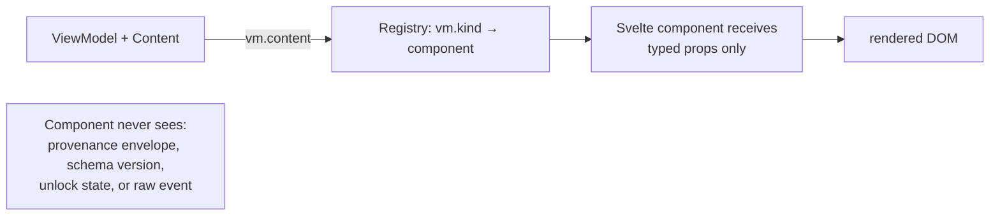

# SCRUTINY Lens — Component Registry

> Status: **Draft** · Cross-references: [view-models.md](view-models.md) · [architecture.md](architecture.md)
> The registry is the deterministic mapping layer between view-models and Svelte components. AI never writes UI code.

---

## 1. Registry contract

```ts
import type { Component } from 'svelte';

/** Maps registry keys → Svelte component type. Keys are registry-owned strings: node VMs map 1:1 as `node.${vm.kind}` (product/vulnerability/metadata/unknown); other VMs use their own keys (`card`, `interpreting`, `facets`, `chat.message`, `session.item`, `result.group`, `state.${vm.kind}`, `node.detail` — the last is selected structurally, not from vm.kind). */
import type { InterpretingVM, FacetSetVM, ResultGroupVM, CardVM, ProductNodeVM, SupportState, VulnerabilityNodeVM, MetadataNodeVM, UnknownNodeVM, NodeDetailVM, ChatMessageVM, Citation, EmptyStateVM, RelayErrorStateVM, UngroundedStateVM, SessionListItemVM } from './types.js';

interface ComponentRegistry {
  card: Component<{ vm: CardVM; onOpen: (id: string) => void }>;
  interpreting: Component<{ vm: InterpretingVM }>;
  facets: Component<{ vm: FacetSetVM; onToggle: (facet: string, value: string) => void }>;
  'result.group': Component<{ vm: ResultGroupVM }>;
  'node.product': Component<{ vm: ProductNodeVM; selected: boolean; onOpen: (id: string) => void }>;
  'node.vulnerability': Component<{ vm: VulnerabilityNodeVM; selected: boolean }>;
  'node.metadata': Component<{ vm: MetadataNodeVM; selected: boolean }>;
  'node.unknown': Component<{ vm: UnknownNodeVM; selected: boolean }>;
  'node.detail': Component<{ vm: NodeDetailVM; onClose: () => void }>;
  'chat.message': Component<{ vm: ChatMessageVM; onCitationHover: (target: Citation | null) => void; onCitationClick: (target: Citation) => void }>;
  'chat.sourcepeek': Component<{ citation: Citation; onOpen: (id: string) => void }>;
  'state.empty': Component<{ vm: EmptyStateVM }>;
  'state.relay-error': Component<{ vm: RelayErrorStateVM; onRetry: () => void }>;
  'state.ungrounded': Component<{ vm: UngroundedStateVM }>;
  'session.item': Component<{ vm: SessionListItemVM; onOpen: (id: string) => void; onDelete: (id: string) => void }>;
}

// Citation: canonical type from docs/types.md (reused directly)
```

## 2. Registry implementation (demo)

```ts
import InterpretationBanner from '$lib/components/InterpretationBanner.svelte';
import FacetSidebar from '$lib/components/sidebar/FacetSidebar.svelte';
import ResultGroupHeader from '$lib/components/ResultGroupHeader.svelte';
import ResultCard from '$lib/components/ResultCard.svelte';
import ProductNode from '$lib/components/graph/ProductNode.svelte';
import VulnerabilityNode from '$lib/components/graph/VulnerabilityNode.svelte';
import MetadataNode from '$lib/components/graph/MetadataNode.svelte';
import UnknownNode from '$lib/components/graph/UnknownNode.svelte';
import NodeDetail from '$lib/components/graph/NodeDetailDrawer.svelte';
import ChatBubble from '$lib/components/chat/ChatBubble.svelte';
import EmptyState from '$lib/components/states/EmptyState.svelte';
import RelayError from '$lib/components/states/RelayError.svelte';
import UngroundedState from '$lib/components/states/UngroundedState.svelte';
import SessionItem from '$lib/components/sidebar/SessionItem.svelte';

export const demoRegistry: ComponentRegistry = {
  card: ResultCard,
  interpreting: InterpretationBanner,
  'chat.sourcepeek': SourcePeekCard,
  facets: FacetSidebar,
  'result.group': ResultGroupHeader,
  'node.product': ProductNode,
  'node.vulnerability': VulnerabilityNode,
  'node.metadata': MetadataNode,
  'node.unknown': UnknownNode,
  'node.detail': NodeDetail,
  'chat.message': ChatBubble,
  'state.empty': EmptyState,
  'state.relay-error': RelayError,
  'state.ungrounded': UngroundedState,
  'session.item': SessionItem,
};
```

## 3. Render flow



**Invariants:**
- Components receive `vm.content` fields only (typed props), never the `provenance` envelope
- Components never import from `lib/ai/` or `lib/fabric/` directly
- Components receive callbacks (`onOpen`, `onClose`, `onCitationHover`, `onCitationClick`) through props — never directly import session store
- The registry is the ONLY place `vm.kind` determines component selection — no `if (vm.kind === 'product')` logic outside the registry

---

## 4. IconToken → Lucide map

```ts
import { Award, ShieldAlert, FileText, Crosshair, Wrench, GitCommitHorizontal,
         CreditCard, Fingerprint, Router, Package, LockKeyhole, Cpu,
         Landmark, Factory, Circle, HelpCircle } from '@lucide/svelte';

export const ICON_MAP: Record<IconToken, typeof Award> = {
  certificate: Award,
  vulnerability: ShieldAlert,
  report: FileText,
  target: Crosshair,
  maintenance: Wrench,
  patch: GitCommitHorizontal,
  smartcard: CreditCard,
  biometric: Fingerprint,
  'network-device': Router,
  software: Package,
  hsm: LockKeyhole,
  tpm: Cpu,
  scheme: Landmark,
  vendor: Factory,
  document: FileText,
  generic: Circle,
  unknown: HelpCircle,
};
```

**CI test** (`vitest`): `Object.keys(ICON_MAP)` must exactly equal `ICON_TOKENS` (the zod enum values). Any missing token → build fails.

---

## 5. Type styling

Status and severity follow the design board tokens (no status dots on product nodes — plain text per design spec 02):

| Token | Color | Usage |
|---|---|---|
| `active` | `text-emerald-600 dark:text-emerald-400` | Product/Metadata status |
| `archived` | `text-amber-600 dark:text-amber-400` | Product/Metadata status |
| `retracted` | `text-stone-500 dark:text-stone-400` + hatch overlay | Retracted nodes (design board D) |
| `unknown` | `text-muted-foreground` | Default/unverified |
| `severity.critical` | `text-red-600` | Vulnerability severity |
| `severity.high` | `text-orange-600` | Vulnerability severity |
| `severity.medium` | `text-yellow-600` | Vulnerability severity |
| `severity.low` | `text-blue-600` | Vulnerability severity |

Selected state (design spec 02): `2px primary border + 4px rgba(primary,.15) ring + elevated shadow`.

---

## 6. Component file structure

```
src/lib/components/
├── ResultCard.svelte              # card → renders CardVM
├── InterpretationBanner.svelte    # A' interpreting stream (InterpretingVM)
├── chat/
│   ├── ChatPanel.svelte           # chat container
│   ├── ChatBubble.svelte          # chat.message → renders ChatMessageVM
│   ├── CitationPill.svelte        # [N] pill with hover/click (internal to ChatBubble)
│   ├── SourcePeekCard.svelte     # chat.sourcepeek → hovercard: cited span ~40 words + 'Open node →'
│   └── FollowUpChips.svelte      # follow-up suggestions
├── graph/
│   ├── SvelteFlow wrappers        # FlowInner, FlowToolbar, MiniMap, Legend, GraphCanvas
│   ├── ProductNode.svelte         # node.product → renders ProductNodeVM
│   ├── VulnerabilityNode.svelte   # node.vulnerability → renders VulnerabilityNodeVM
│   ├── MetadataNode.svelte        # node.metadata → renders MetadataNodeVM
│   ├── UnknownNode.svelte         # node.unknown → renders UnknownNodeVM
│   ├── NodeDetailDrawer.svelte    # node.detail → renders NodeDetailVM
│   ├── FloatingEdge.svelte        # edge rendering (from old code)
│   └── MiniMap.svelte             # minimap (from old code)
├── states/
│   ├── EmptyState.svelte          # state.empty → renders EmptyStateVM
│   ├── RelayError.svelte          # state.relay-error → renders RelayErrorStateVM
│   └── UngroundedState.svelte     # state.ungrounded → renders UngroundedStateVM
└── sidebar/
    └── SessionItem.svelte         # session.item → renders SessionListItemVM
```
