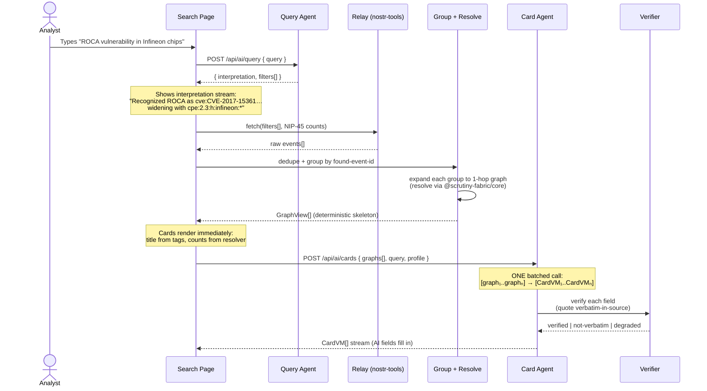
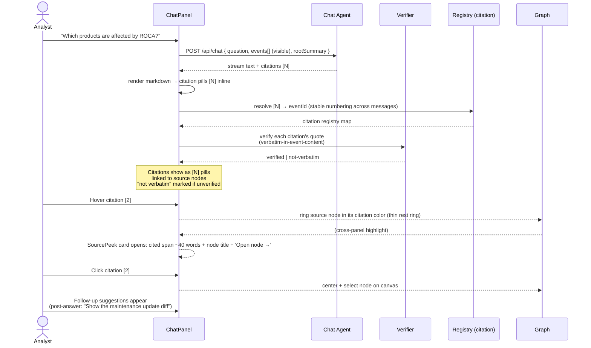
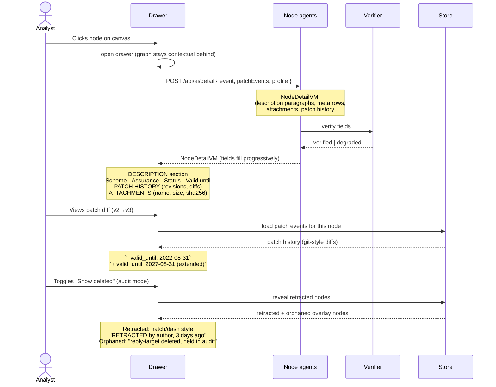
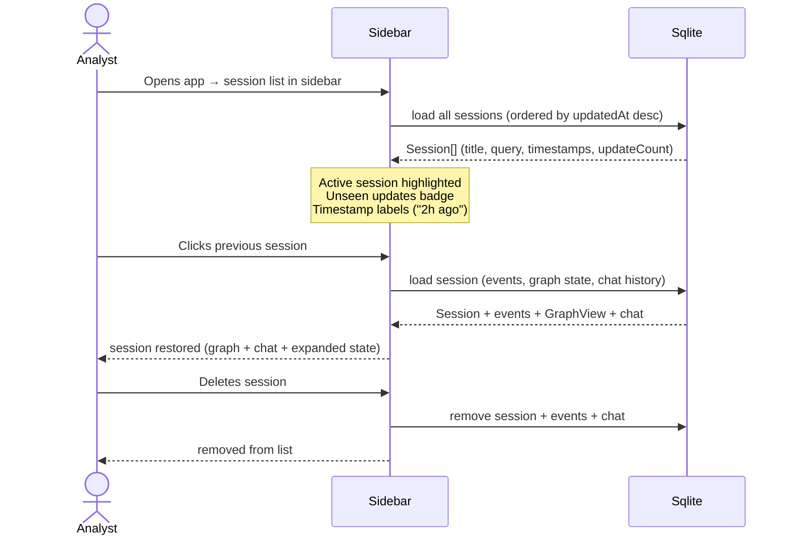

# SCRUTINY Lens — Happy Path Journeys

> Status: **Draft** · Cross-references: [prd.md](prd.md) · [architecture.md](architecture.md) · [view-models.md](view-models.md)
> Every journey is a testable sequence with acceptance criteria. Edge states are mandatory, not afterthoughts.

---

## J1 — Search & Interpret



**Acceptance criteria:**
1. Search page renders ≤200ms after navigation
2. Query interpretation stream shows ≤2s after submit (interpretation + `widened`/`traversing` step entries)
3. Deterministic card skeletons (title, counts, badges) visible ≤3s after relay response
4. AI-filled fields (snippet, match rationale) fill in per batch ≤10s after skeleton
5. Relay unreachable → relay-error state per the edge-state table: per-relay status (ok/timeout/refused) + "Retry failed relays" + "Continue anyway". NO fixture data is ever shown (owner veto 2026-08-23)
6. Empty results → "No certificates matched" screen with widen-query chips (design board state E)
7. Query agent filters validated against `KNOWN_INDEXER_PREFIXES`; invalid filters rejected
8. Facet sidebar shows the pack matching the interpreted query type (identifier → minimal; CVE → severity/exploit toggles; certificate → certified/expiry dates; vendor → category/manufacturer); counts recompute on every selection; OR-within/AND-across; applied filters show as removable chips; Publishers facet offers include/exclude/any with human names

---

## J2 — Open Graph Session

```mermaid
sequenceDiagram
    actor U as Analyst
    participant UI as Session Page
    participant S as Session Store
    participant N as Node Agents
    participant V as Verifier
    participant F as Flow (XYFlow)

    U->>UI: Clicks "Open graph" on a card
    UI->>S: create session (root = card's found event)
    S->>S: build graph via resolver
    S-->>UI: GraphView (nodes, edges, retracted marked)
    UI->>F: render canvas + layout
    Note over F: d3-force continuous layout;<br/>product/CVE-hub/metadata node types
    UI->>N: POST /api/ai/nodes { events[], query }
    Note over N: ONE batched call:<br/>[event₁..eventₖ visible] → [NodeVM₁..NodeVMₖ]
    N->>V: verify each field
    V-->>N: verified | not-verbatim | degraded
    N-->>UI: NodeVM[] stream (AI fields fill per batch)
    Note over UI: Node titles, icons, type labels<br/>appear as NodeVMs arrive
    U->>UI: Clicks "+" on node (expand)
    UI->>S: fetchNodeNeighbors(root) → add to graph
    S-->>UI: expanded graph
    UI->>N: interpret new visible nodes (batched)
    N-->>UI: new NodeVMs stream
    U->>UI: Adjusts hop depth (1→2→3)
    UI->>S: expandToHop(depth) → batched BFS
    S-->>UI: graph expanded to depth
    Note over UI: Hop expansion processes in batches of 20<br/>(HOP_BATCH_SIZE) to avoid relay overwhelm
```

**Acceptance criteria:**
1. Graph renders immediately after card click (deterministic: nodes from resolver, layout from d3-force)
2. Node interpretations stream in ≤15s per visible batch
3. "+" expand fetches neighbors ≤3s, new nodes interpret in ≤10s
4. Hop depth slider: each level reveals correct BFS layer, no duplicate nodes
5. Node drag persists position (drag channel in layout); layout doesn't fight user dragging
6. Zoom/pan smooth; minimap reflects viewport; fit/auto-layout buttons work
7. "Show deleted" toggle reveals retracted nodes (hatch/dash style, per design board)
8. Legend shows node types (product/CVE/metadata), edge types, status colors
9. Interpreting new nodes doesn't reset the layout of existing nodes

---

## J3 — Grounded Chat



**Acceptance criteria:**
1. Chat answers stream token-by-token (real streaming, not fake `res.text()`)
2. Every citation [N] maps to a visible graph node; clicking highlights + centers it
3. Citation support renders as computed 3-state (verbatim / partial / extrapolatory); 'partial' = blockquote match, 'extrapolatory' = "beyond graph"; computed states visually distinct from any model-assessed notes
4. Ungrounded questions → honest refusal: "That isn't on this graph…" (design board state E)
5. Follow-up suggestions appear after each answer (max 3, contextual)
6. Citation numbering is stable across the conversation (registry, not per-message)
7. Chat history preserved per session (sqlite), restored on session reopen
8. LLM timeout → partial answer preserved + error state, not silent hang
9. If no nodes visible → chat disabled with explanation
10. Color pairing (deterministic from n): pill tint, cited-span wavy underline (dual code, mandatory), SourcePeek accent bar, graph node ring all share the citation's palette color
11. During streaming, unresolved [N] markers render `pending` (dimmed, non-clickable) and resolve in place as citation batches complete; a pending pill never renders a fake link
12. Each assistant message shows a claims strip: "4 of 5 claims verified · 1 beyond-graph" (computed counts, not model weigh-in)
13. Copy on a chat turn exports markdown footnotes (`[^N]`) preserving citations into external reports

---

## J4 — Node Detail & Audit



**Acceptance criteria:**
1. Drawer opens on node click without disrupting graph layout (backdrop-blur overlay)
2. Node detail fields fill progressively (description, meta, attachments, patch history)
3. Patch diffs render as git-style diff view (green/red lines, correct `a/content`/`b/content` application per spec C1)
4. Retracted nodes: visible only in audit mode, marked with retraction reason + date + author
5. Orphaned annotations: marked "reply-target deleted, held in audit (α/β degradation)"
6. "A retraction can't be undone" note per design board (kind 5 semantics)
7. Validation status comes from `@scrutiny-fabric/core` — all protocol rules enforced
8. Malformed events skipped with count (design board: "couldn't reach all relays" states)

---

## J5 — Session Management



**Acceptance criteria:**
1. Session list loads instantly on app open (from sqlite)
2. Sessions ordered by updatedAt, active highlighted
3. Reopening a session restores: graph state (`expandedNodeIds`, `hopDepth`) + chat history (`ChatTurn[]` as in api.md; rendering shape `ChatMessageVM` rebuilt on load)
4. Session title auto-generated from query (or first 50 chars)
5. Delete removes session + all associated data (events, chat, cached VMs for that session only)
6. New updates badge: shows when late-arriving events added bindings to a session's root (sync check on sidebar render)

---

## Edge State Summary (design board screen E)

| State | Trigger | UI |
|---|---|---|
| **Empty** | Zero results from relay | "No certificates matched" + widen-query chips (`cpe:*`, `cwe:*`, free-text) |
| **Relay error** | Partial/multi-relay failure | Per-relay status (ok/timeout/refused) + "Retry failed relays" + "Continue anyway" |
| **Ungrounded** | Question outside visible graph | "That isn't on this graph. The bound metadata here is…" + follow-up suggestions |
| **Retracted** | kind-5 deleted node | Hatch/dash node + "RETRACTED" badge + reason; visible only in audit mode |
| **Degraded** | LLM unavailable | Deterministic skeleton + "uninterpreted" placeholders; "partial" badge on card |
| **Demo** | — | REMOVED (owner veto: app never fabricates demo data; relay unreachable → relay-error state) |
