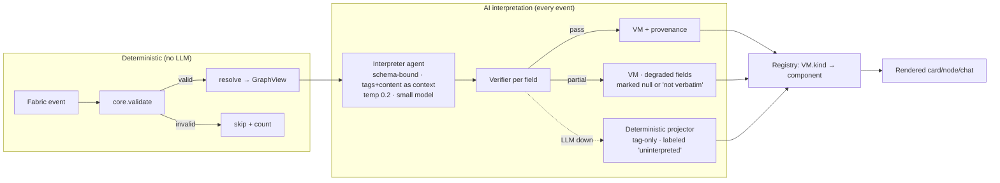
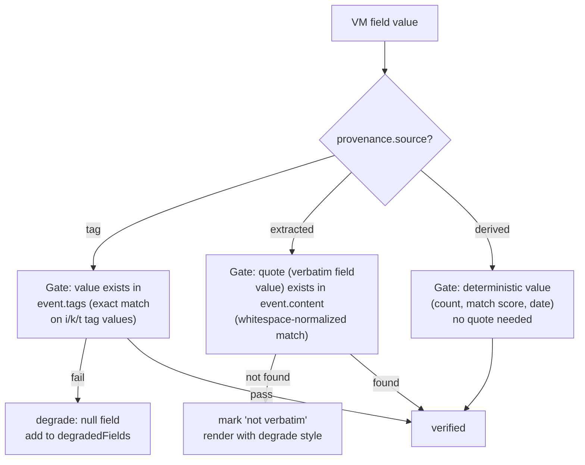

# SCRUTINY Lens — View-Model Catalog

> Status: **Draft** · Cross-references: [prd.md](prd.md) · [journeys.md](journeys.md) · [architecture.md](architecture.md) · [component-registry.md](component-registry.md)
> Every VM is one zod schema. The AI fills values; the component registry renders. AI chooses semantics, never presentation.

---

## 0. Pipeline: how VMs are produced



---

## 1. Shared envelope

Every VM wraps content in a provenance envelope. The envelope is **internal** — stored in cache, used by verifier, never rendered to user (Q4 grill decision).

```ts
/** Internal-only provenance envelope. schemaVersion + profile live in the cache KEY, not duplicated here. Never sent to components. */
interface Provenance {
  /** How this VM was produced */
  origin: 'interpreted' | 'projected' | 'partial';
  /** Fields that failed verification (tag-gate fail, or derived uncomputable) */
  degradedFields: string[];
  /** Extracted fields whose quote failed the verbatim gate */
  notVerbatimFields: string[];
}

/** Stored VM (cache + agent results). */
interface ViewModel<T> {
  content: T & DegradationProjection;
  provenance: Provenance;
}

/** Derived into content so components can render degradation WITHOUT seeing provenance (I5/I8 contract). */
interface DegradationProjection {
  /** Render these fields as 'uninterpreted' placeholders */
  degraded?: string[];
  /** Render these citations/spans with the 'not-verbatim' mark */
  notVerbatim?: string[];
}
// Component props = VM.content (incl. these projections). Never the envelope.
```

---

## 2. IconToken enum

Closed vocabulary — the model picks from these tokens; `ICON_MAP` maps to Lucide. The model never names an icon.

```ts
type IconToken =
  // Entity types
  | 'certificate'      // CC certificate, product cert
  | 'vulnerability'    // CVE, CWE, advisory
  | 'report'           // certification report, security target
  | 'target'           // security target document (TOE)
  | 'maintenance'      // maintenance update, assurance continuity
  | 'patch'            // diff/patch event
  // Product categories
  | 'smartcard'        // smartcard IC, secure element
  | 'biometric'        // biometric sensor/system
  | 'network-device'   // router, firewall, network appliance
  | 'software'         // software package, library
  | 'hsm'              // hardware security module
  | 'tpm'              // trusted platform module
  // Scheme/authority
  | 'scheme'           // certification scheme (BSI, ANSSI, NIAP…)
  | 'vendor'           // manufacturer
  // Generic fallbacks
  | 'document'         // generic metadata
  | 'generic'          // unclassified entity
  | 'unknown';         // type not determined
```

| Token | Lucide icon | Used on |
|---|---|---|
| certificate | `Award` | ProductNodeVM (type certificate), ResultCardVM |
| vulnerability | `ShieldAlert` | VulnerabilityNodeVM, badges |
| report | `FileText` | MetadataNodeVM (metaType: report) |
| target | `Crosshair` | MetadataNodeVM (metaType: target) |
| maintenance | `Wrench` | MetadataNodeVM (metaType: maintenance) |
| patch | `GitCommitHorizontal` | Patch history entries |
| smartcard | `CreditCard` | ProductVM (category) |
| biometric | `Fingerprint` | ProductVM (category) |
| network-device | `Router` | ProductVM (category) |
| software | `Package` | ProductVM (category) |
| hsm | `LockKeyhole` | ProductVM (category) |
| tpm | `Cpu` | ProductVM (category) |
| scheme | `Landmark` | FacetVM, badges |
| vendor | `Factory` | FacetVM, badges |
| document | `FileText` | UnknownNodeVM |
| generic | `Circle` | UnknownNodeVM |
| unknown | `HelpCircle` | UnknownNodeVM |

---

## 3. VM Catalog

### 3.1 InterpretingVM — query interpretation states (screen A′)

Produced by: query agent, streamed to UI during query interpretation.
Design board: "Recognized ROCA as cve:CVE-2017-15361 → resolving CVE metadata… widening with cpe:2.3:h:infineon:*"

```ts
interface InterpretingStep {
  /** What the agent recognized or did */
  kind: 'recognized' | 'queried' | 'widened' | 'traversing' | 'resolved';
  /** Human-readable label */
  label: string;
  /** Detail (e.g., the identifier resolved, the CPE widened) */
  detail?: string;
  /** The indexer prefix if applicable (cve:, cpe:, cc:) */
  prefix?: string;
  /** The identifier value if applicable */
  value?: string;
}

interface InterpretingVM {
  steps: InterpretingStep[];
  /** Final filter plan — the relay queries that will run */
  filters: SearchFilter[];
  /** One-line interpretation (the api.md response field) */
  interpretation: string;
  /** Expanded interpretation summary */
  summary: string;
}
```

| Field | Type | Domain | Required | Provenance |
|---|---|---|---|---|
| steps[].kind | enum | recognized/queried/widened/traversing/resolved | yes | — |
| steps[].label | string | ≤120 chars | yes | — |
| steps[].detail | string? | ≤200 chars | no | — |
| filters | SearchFilter[] | valid per KNOWN_INDEXER_PREFIXES | yes | — |
| summary | string | ≤300 chars | yes | — |

---

### 3.2 CardVM — search result card (screen B)

Produced by: card agent (batched). Card = one interpreted graph (found event + 1-hop binding neighborhood).
Design board: "Infineon M7794 A12 / A22 · Infineon Technologies AG · Secure microcontroller (smartcard IC) · BSI-DSZ-CC-0814-2012 · ROCA key generation library affected by CVE — practical factorization of public keys."

**Division of labor (research D1):** card carries title + typeToken + metaSegments + snippet + match cue + stats; everything else (graph, facet table, detail) lives behind "Open graph". Cards must support **select/reject without opening** (Baymard spec-driven-list evidence).

```ts
/** AI-composed card summary with deterministic quality rules (R1-R8 below). */
interface Snippet {
  text: string;            // ≤300 chars, never mid-sentence-truncated
  /** Query-term spans to bold (≤2). Rendered strong; NOT model-chosen decoration. */
  highlights?: Array<{ start: number; len: number }>;
}

interface CardVM {
  /** The found event id (graph root — product or metadata) */
  entityId: string;

  /** One-line title — server-enforced ≤120 chars + ellipsis at 121 (sec-certs 500-char-title anti-pattern) */
  title: string;

  /** Vendor or issuing organization */
  vendor?: string;

  /** Type token for icon + color mapping */
  typeToken: IconToken;

  /** Category label */
  category?: string;

  /** Identifier chips (max 2, JetBrains Mono) */
  identifiers: string[];

  /** Schema/body (e.g., "BSI · Germany") */
  scheme?: string;

  /** Assurance level — matches ^EAL[1-7]\+?$ */
  assurance?: string;

  /** Status */
  status: 'active' | 'archived' | 'retracted' | 'unknown';

  /** Meta line segments — SERVER-composed deterministically in fixed order
    * ["scheme flag+code", "EAL", "status", "date"], joined with "·".
    * Missing segments are silently dropped (with their separators) — never "N/A"/"—"
    * (live-catalog evidence: sec-certs/NVD/CVE.org/CC-portal all omit silently). */
  metaSegments: string[];

  /** The only relevance cue shown on a card. Band is DETERMINISTIC:
    *  high    = identifier hit (query identifier ∈ identifiers | bound identifiers)
    *            OR (query term coverage 100% AND ≥1 facet overlap)
    *  medium  = term coverage ≥60% OR ≥2 facet overlaps
    *  low     = everything else in the group (e.g. same-vendor-platform tier)
    * matchReasons ≤3 computed facts phrased by the agent (validator re-binds each to
    * its deterministic input; invented reasons are rejected to dead_letter). */
  matchBand: 'high' | 'medium' | 'low';
  matchReasons: string[];   // e.g. ["identifier: cve:CVE-2017-15361", "status: Active", "facet: EAL4+"]

  /** AI-composed card summary (interpreted — never quote-gated; quality gated R1-R8) */
  snippet: Snippet;

  /** Sort key ONLY — never displayed in any form. */
  match: number;

  /** Stats from resolver (deterministic) — bare integers only */
  stats: { boundMetadata: number; attachments: number; updates: number };

  /** Raw event + neighborhood graph for session-open handoff */
  graph: GraphView;

  /** Facet hits this card satisfies (for filtering) */
  facets: Record<string, string[]>;

  /** Which interpreted sub-query group this card belongs to (screen B grouping) */
  groupKey?: string;
}
```

| Field | Type | Domain | Required | Provenance |
|---|---|---|---|---|
| entityId | string | event id | yes | — |
| title | string ≤120 | ellipsis >120 | yes | extracted |
| vendor | string? | ≤100 chars | no | tag \| extracted |
| typeToken | IconToken | enum | yes | extracted |
| category | string? | ≤60 chars | no | extracted |
| identifiers | string[] | ≤2 items, ≤40 chars each | yes (≥1) | tag \| extracted |
| scheme | string? | ≤60 chars | no | tag \| extracted |
| assurance | string? | `^EAL[1-7]\+?$` | no | tag \| extracted |
| status | enum | active/archived/retracted/unknown | yes | tag \| derived |
| metaSegments | string[] | fixed order, silent omission | yes | derived (compose) |
| matchBand | enum | band rule above | yes | derived |
| matchReasons | string[] ≤3 | fact-rebindable | yes | interpreted (validated) |
| snippet.text | string ≤300 | R1-R8 below | yes | interpreted |
| snippet.highlights | spans ≤2 | query terms only | no | extracted |
| match | number 0-1 | SORT-ONLY | yes | derived |
| stats.* | int | ≥0 | yes | derived (resolver) |
| graph | GraphView | resolver output | yes | derived (resolver) |
| facets | Record | facet → values | yes | derived |
| groupKey | string? | ResultGroupVM.key | no | derived |

**Snippet quality contract R1-R8** (prompt contract + deterministic pre-render validator; a failed rule → degrade snippet via dead_letter):

| # | Rule | Validator check |
|---|---|---|
| R1 | **Term coverage**: every query term appears ≥1× (normalized, stopwords exempt) | deterministic |
| R2 | **Entity-first**: first 12 words contain the entity name or an identifier | deterministic |
| R3 | **Query-biased**, not lead-copying: never the event's opening sentence unless it covers the query (Tombros & Sanderson '98) | similarity check |
| R4 | **One coherent span** — 1–3 continuous sentences; never stitched fragments | origin-index coherence |
| R5 | **Bolding ≤2 spans**, query terms only (highlights offsets) | deterministic |
| R6 | **Length** ≤300 chars (~2 lines), no mid-sentence truncation | deterministic |
| R7 | **No boilerplate** (banned openers: "This event", "This document", "In this data") and no keyword stuffing | deterministic |
| R8 | **No meta duplication** — never restates scheme/EAL/status/identifiers already in metaSegments | overlap check |

**Card ↔ detail verbatim-superset contract** (research D3): the drawer's header fields (title, vendor, scheme, assurance, status) are **by-reference the same interpreted entity record** the card read — one entity = one interpretation per cache key (entityId·schemaVersion·profile·model, Q6). Detail agents must not restate status/assurance differently; conflicts lose to the card's record. The snippet's "interpreted" provenance follows unchanged into the drawer.

**Ideal example** (design board screen B, Infineon M7794):
```json
{
  "entityId": "abc123…",
  "title": "Infineon M7794 A12 / A22",
  "vendor": "Infineon Technologies AG",
  "typeToken": "smartcard",
  "category": "Secure microcontroller (smartcard IC)",
  "identifiers": ["BSI-DSZ-CC-0814-2012"],
  "scheme": "BSI · Germany",
  "assurance": "EAL4+",
  "status": "active",
  "metaSegments": ["BSI · Germany", "EAL4+", "Active"],
  "matchBand": "high",
  "matchReasons": ["identifier: cve:CVE-2017-15361", "status: Active"],
  "snippet": {
    "text": "RSA key generation library affected by ROCA — practical factorization of public keys. Certification report and security target attached; one maintenance update on record.",
    "highlights": [{ "start": 34, "len": 4 }]
  },
  "match": 0.97,
  "stats": { "boundMetadata": 5, "attachments": 2, "updates": 3 },
  "groupKey": "cve:CVE-2017-15361",
  "facets": { "scheme": ["BSI"], "assurance": ["EAL4+"], "status": ["Active"] }
}
```

**Degraded example** (LLM unavailable, projection-only):
```json
{
  "entityId": "abc123…",
  "title": "Infineon M7794 A12 / A22",
  "typeToken": "unknown",
  "identifiers": ["BSI-DSZ-CC-0814-2012"],
  "status": "active",
  "metaSegments": ["Active"],
  "matchBand": "low",
  "matchReasons": [],
  "snippet": { "text": "" },
  "match": 0.0,
  "stats": { "boundMetadata": 5, "attachments": 2, "updates": 3 }
}
```
(With `provenance.origin = 'projected'` and `degradedFields = ["snippet", "matchReasons", "vendor", "category", "typeToken"]` — `match`/`metaSegments` stay computable, so they stay; `matchBand` degrades to "low" honestly.)

---

### 3.3 ResultGroupVM — results grouping (screen B hero grouping)

Produced by: deterministic projection from query agent filters + resolver counts. No LLM. Design board: "Directly ROCA-affected · CVE-2017-15361 — 18 certificates" / "cpe:2.3:h:infineon:* · same-vendor platform — 110 certificates".

```ts
interface ResultGroupVM {
  /** Group key — matches CardVM.groupKey */
  key: string;
  /** Header label (e.g. "Directly ROCA-affected · CVE-2017-15361") */
  label: string;
  /** The filter that produced this group */
  basis: SearchFilter;
  /** Count of cards in this group */
  count: number;
}
```

| Field | Type | Domain | Required | Provenance |
|---|---|---|---|---|
| key | string | stable id | yes | derived |
| label | string | ≤80 chars | yes | derived |
| basis | SearchFilter | — | yes | derived |
| count | int | ≥0 | yes | derived (resolver) |

Default sort: cards by `match` desc within groups ("Sort: Relevance"); other sorts deferred.

---

### 3.4 FacetSetVM — dynamic filter sidebar (screen B)

Produced by: facetPlanner (deterministic). The interpreted query type selects a facet **pack**; the profile adds an **overlay** beneath it. All wording is analyst language — never protocol jargon ("kind", "tag", "nip"). Dynamic packs per UX research (Baymard category-specific facet sets; Algolia Dynamic Facets pattern). [research/facet-ux-patterns.md, security-catalog-facets.md]

**Interaction contract (Baymard-backed):**
- Checkboxes; **OR within one facet, AND across facets**. Live per-option counts; "Show more" past 8 options; in-facet search beyond ~15 options.
- Applied filters render as removable chips above results ("Active ×", "Certified ≥ 2024 ×").
- Empty facets hidden. Sidebar pins **base** group top, **query pack** middle, **profile overlay** bottom; facets duplicated between pack and overlay merge, never repeat.
- **Two labeled date domains** (user-locked): `Published to fabric` (event time, relay-side) vs `Certified` (fact date, content-extracted). Never conflated.

```ts
interface FacetOption {
  value: string;
  /** Plain-English label — e.g. "EAL4+ (EAL4 augmented)", "sec-certs.org audit corpus" */
  label: string;
  /** One-line plain-English explanation for technical terms */
  gloss?: string;
  count: number;
  /** Trust facets are tri-state; others use include-only semantics */
  state: 'include' | 'exclude' | 'any';
}

interface Facet {
  key: string;
  label: string;
  /** Which selection layer produced this facet */
  group: 'base' | 'query' | 'profile';
  kind: 'multiselect' | 'toggle' | 'date-range' | 'text';
  /** Date-range facets only — which labeled domain */
  dateDomain?: 'published' | 'certified';
  options: FacetOption[];
  /** Value provenance tier → when it fills (skeleton vs post-interpretation) */
  source: 'relay' | 'graph' | 'interpretation';
}

interface FacetSetVM {
  /** Pack selected by the interpreted query type */
  pack: 'base' | 'identifier' | 'vulnerability' | 'certificate' | 'product';
  facets: Facet[];
  /** Events in current result set / matching current filter selection */
  total: number;
  matched: number;
}
```

| Field | Type | Domain | Required | Provenance |
|---|---|---|---|---|
| pack | enum | 5 packs | yes | derived |
| facets[].group | enum | base/query/profile | yes | derived |
| facets[].kind | enum | multiselect/toggle/date-range/text | yes | derived |
| facets[].dateDomain | 'published'\|'certified'? | date facets only | no | derived |
| options[].label | string | plain English | yes | derived |
| options[].gloss | string? | ≤80 chars | no | derived |
| options[].count | int | ≥0 | yes | relay/graph/interpretation |
| options[].state | enum | include/exclude/any | yes | derived |
| total / matched | int | ≥0 | yes | derived |

**Facet packs** (label → filters → source tier):

- **base** (always): Document type (graph) · Published to fabric (relay, date-range `published`) · **Publishers** (trust, multiselect tri-state, human names — "sec-certs.org audit corpus", "NXP (vendor statement)", "community submitted") · Keywords (text refine)
- **identifier** (exact cert/cve id typed): pack collapses — base only + result chip; sidebar minimal
- **vulnerability** (CVE/CWE search): Severity (worded bands) · Weakness type · **Public exploit exists** (toggle) · Actively exploited (tri-state toggle) · Affected platform
- **certificate** (cert-ish query): **Certified** (date-range `certified`) · **Expiry / Valid beyond** (date-range `certified` window: <1y, ≥2027…) · Status · Certifying body · Assurance level (EAL, glossed)
- **product** (vendor/product browse): Product category · Manufacturer · Status · **Has attachments** (toggle) · **Maintained** (has updates, toggle)
- **profile overlays**: smartcard → chip family + EAL glosses; certificate → assurance-continuity window + maintained-certs; generic → category + vendor emphasis

| Field (pack table) | Notes |
|---|---|
| Publishers facet | tri-state include/exclude/any (NVD pattern); names come from known-publisher map (pubkey → display name), unknown publishers show as "unknown publisher" |
| Date domains | both labeled separately per catalog evidence (NVD three labeled date domains; sec-certs Certification/Archive pairs) |

---

### 3.5 NodeVM — graph node on canvas (Journey J2)

Produced by: node agent (batched per visible nodes). Design board: product node, CVE hub node, metadata node (3 types + selected state).

```ts
/** Shared fields for all node types */
interface BaseNodeVM {
  /** event id */
  entityId: string;
  /** Node kind — determines which component renders it */
  kind: 'product' | 'vulnerability' | 'metadata' | 'unknown';
  /** Display title */
  title: string;
  /** Type token for icon mapping */
  typeToken: IconToken;
  /** Status */
  status: 'active' | 'archived' | 'retracted' | 'unknown';
  /** Is this node retracted (kind-5)? */
  retracted: boolean;
  /** Whether this node is the graph root */
  isRoot: boolean;
}

interface ProductNodeVM extends BaseNodeVM {
  kind: 'product';
  /** Identifier line (e.g., "BSI-DSZ-CC-0814-2012") */
  identifier?: string;
  /** Update count */
  updates: number;
  /** Assurance level */
  assurance?: string;
  /** Scheme */
  scheme?: string;
  /** Preview of bound metadata (type labels, not full VMs) */
  bindings: Array<{ metaType: string; label: string }>;
}

interface VulnerabilityNodeVM extends BaseNodeVM {
  kind: 'vulnerability';
  /** CVE or CWE identifier */
  identifier: string;
  /** Which identifier kind — CWE-rooted searches produce CWE nodes */
  identifierKind: 'cve' | 'cwe';
  /** Severity label */
  severity?: 'Critical' | 'High' | 'Medium' | 'Low' | 'Unknown';
}

interface MetadataNodeVM extends BaseNodeVM {
  kind: 'metadata';
  /** What kind of metadata */
  metaType: 'report' | 'target' | 'maintenance' | 'sbom' | 'advisory' | 'unknown';
  /** Short label */
  label: string;
  /** Size (for attachments) */
  size?: string;
  /** Date of publication/maintenance */
  date?: string;
}

interface UnknownNodeVM extends BaseNodeVM {
  kind: 'unknown';
  /** AI-generated summary of unparseable content */
  summary: string;
  typeToken: 'generic' | 'document' | 'unknown';
}

type NodeVM = ProductNodeVM | VulnerabilityNodeVM | MetadataNodeVM | UnknownNodeVM;
```

| Field (ProductNodeVM) | Type | Domain | Required | Provenance |
|---|---|---|---|---|
| entityId | string | event id | yes | — |
| kind | literal 'product' | — | yes | tag |
| title | string | ≤100 chars, 1 line | yes | extracted |
| typeToken | IconToken | enum | yes | extracted |
| status | enum | — | yes | tag |
| retracted | bool | — | yes | derived |
| isRoot | bool | — | yes | derived |
| identifier | string? | ≤50 chars | no | tag \| extracted |
| updates | int | ≥0 | yes | derived (resolver) |
| assurance | string? | `^EAL[1-7]\+?$` | no | tag \| extracted |
| scheme | string? | ≤60 chars | no | tag \| extracted |
| bindings[].metaType | string | — | yes | derived |
| bindings[].label | string | ≤60 chars | yes | derived |

---

### 3.6 NodeDetailVM — node detail drawer (Journey J4)

Produced by: detail agent (on demand — one node at a time).
Design board: full drawer with description, meta rows, attachments, patch history.

```ts
interface PatchDiff {
  /** Old value (red line) */
  old: string;
  /** New value (green line) */
  new: string;
  /** Which field changed */
  field: string;
  /** Unchanged context lines around the hunk */
  context?: string[];
}

interface PatchEntry {
  /** Patch event id */
  patchId: string;
  /** Lifecycle entry kind */
  kind: 'issue' | 'maintenance' | 'retraction' | 'other';
  /** Transition label (e.g. "v2 → v3" or "Retraction" — not always a version bump) */
  change: string;
  /** Date of the patch */
  date: string;
  /** Summary of what changed */
  summary: string;
  /** Individual diffs */
  diffs: PatchDiff[];
}

interface Attachment {
  name: string;
  size?: string;
  sha256?: string;
  type?: string;  // 'pdf' | 'json' | 'xml' | etc
}

interface MetaRow {
  key: string;
  value: string;
}

interface NodeDetailVM {
  entityId: string;
  kind: BaseNodeVM['kind'];

  /** AI-interpreted description (markdown, grounded in event content) */
  description: string;

  /** Meta table rows (scheme, assurance, status, valid until, category…) */
  metaRows: MetaRow[];

  /** Attachments from imeta tags */
  attachments: Attachment[];

  /** Patch history with diffs */
  patchHistory: PatchEntry[];

  /** Lifecycle dates (ISO 8601; extracted when corpus carries no typed date tags) */
  certificationDate?: string;
  /** Certificate validity end ("Valid until: 2027-08-31" on design board) */
  validUntil?: string;
  /** Dates of maintenance events, newest first */
  maintenanceDates?: string[];
  /** Protection Profile conformance list */
  ppConformance?: string[];
  /** Source attribution (e.g. "sec-certs.org · Infineon Technologies AG") */
  sourceAttribution?: string;
  /** Set when drawer opened from a citation — quote highlighted in description */
  citationFocus?: { quote: string };

  /** Retraction info (only if retracted) */
  retraction?: {
    reason: string;
    date: string;
    author: string;
  };

  /** Orphan info (only if orphaned — reply-target deleted) */
  orphan?: {
    reason: string;
    /** α/β degradation grade from overlay rules */
    degradation?: 'alpha' | 'beta';
  };
}
```

| Field | Type | Domain | Required | Provenance |
|---|---|---|---|---|
| description | string | markdown, grounded | yes | extracted |
| metaRows[].key | string | ≤30 chars | yes | — |
| metaRows[].value | string | ≤100 chars | yes | tag \| extracted |
| attachments[].name | string | — | yes | tag |
| attachments[].size | string? | — | no | tag |
| attachments[].sha256 | string? | hash | no | tag |
| patchHistory[].change | string | "vN → vM" | yes | derived |
| patchHistory[].date | string | date | yes | tag |
| patchHistory[].diffs[].old | string | — | yes | derived |
| patchHistory[].diffs[].new | string | — | yes | derived |
| retraction.reason | string? | — | no | tag |
| retraction.date | string? | — | no | derived |

---

### 3.7 ChatMessageVM — chat message with citations (Journey J3)

Produced by: chat agent (streaming) + citation registry + quote verifier. Design board: "All three Infineon parts on this graph — M7794, SLE78 / M7892 and SLE97 — are bound to CVE-2017-15361 (ROCA)¹."

```ts
/** How well this citation's content supports the claim beside it — COMPUTED at resolve-time
  * (never model-opinion). 'partial' = blockquote/subset match; 'extrapolatory' = no match
  * ("beyond graph"). Computed states MUST render visually distinct from model-assessed content
  * (per ProductUX + GroundingTrust research). */
type SupportState = 'verbatim' | 'partial' | 'extrapolatory';

interface Citation {
  /** Stable citation number (per-conversation) — also drives the color pairing (colorIndex = f(n)) */
  n: number;
  /** The event id cited */
  eventId: string;
  /** Candidate quote the assistant offered for the claim it sits beside */
  quote: string;
  /** Resolved support state (computed; replaces old binary `verified`) */
  support: SupportState;
  /** Cited span from event.content as resolved (blockquote-normalized) — shown in the SourcePeek hovercard */
  span?: string;
  /** Streaming lifecycle: [N] markers arrive in text before resolution batches complete.
    * 'pending' renders dimmed and is NEVER clickable; resolves in place (Perplexity streaming discipline). */
  status: 'pending' | 'resolved';
  /** Model-assessed extra context (e.g. contradiction note) — renders as assessed, never as a computed check */
  assessed?: boolean;
  /** The node's display title (for hovercard) */
  nodeTitle?: string;
  /** Deterministic citation color index — registry assigns from n (color = presentation, not semantics; I1) */
  colorIndex: number;
}

interface ClaimsSummary {
  /** Number of claims the verifier classified in this message (computed) */
  total: number;
  verbatim: number;
  partial: number;
  extrapolatory: number;
}

interface ChatMessageVM {
  /** Message text — markdown with [N] citation markers inline */
  content: string;
  /** Structured citations for rendering as interactive pills */
  citations: Citation[];
  /** Computed claims strip: "4 of 5 claims verified · 1 beyond-graph" */
  claimsSummary?: ClaimsSummary;
  /** Suggested follow-up questions (max 3) */
  followUps: string[];
  /** Role */
  role: 'user' | 'assistant';
}
```

| Field | Type | Domain | Required | Provenance |
|---|---|---|---|---|
| content | string | markdown ≤2000 chars | yes | — |
| citations[].n | int | ≥1 | yes | derived (registry) |
| citations[].eventId | string | event id | yes | derived (registry) |
| citations[].quote | string | candidate | yes | — |
| citations[].support | SupportState (computed) | — | yes | derived (verifier) |
| citations[].status | 'pending'\|'resolved' | — | yes | derived (streaming) |
| citations[].span | string? | — | no | derived (resolver) |
| citations[].colorIndex | int ≥0 | — | yes | derived (registry, n→palette) |
| citations[].assessed | bool? | — | no | model context (renders as assessed) |
| claimsSummary.* | int | — | no | derived (verifier) |
| followUps[] | string | ≤100 chars, max 3 | no | — |

---

**Citation presentation contract (color pairing — owner design 2026-08-23):**

Citations are chromatically paired across four surfaces using a deterministic palette assigned by the registry from `n` (NOT chosen by the model — I1):

```ts
/** Fixed 6-slot, dual-coded palette (owner pick 2026-08-23: soft neutrals — excludes every
  * app-semantic hue: primary/warn/danger/ok/body). colorIndex = (n - 1) % CITATION_PALETTE.length
  * Slot 5 (#94a3b8) coincides with the app's muted-text value — documented swap to #64748b
  * if it reads 'disabled' in situ. */
const CITATION_PALETTE = ['#6366f1', '#8b5cf6', '#ec4899', '#06b6d4', '#94a3b8', '#6b7280'] as const;
```

| Surface | Rendering of citation [N]'s color |
|---|---|
| Pill `[N]` in prose | tinted border/background in palette color |
| Cited span in assistant prose | **wavy underline** in palette color (dual code — required; color is never the only channel) |
| SourcePeek hovercard | left accent bar in palette color |
| Graph node ring | resting thin ring in palette color while its citing message is visible in the chat viewport; hover pill → thick ring + center + SourcePeek opens |

Rules: palette slot assignment is registry-deterministic; per visible message, colors SHOULD be unique among its citations (registry skips reuse within one message when >1 citation). Copy action exports the message as markdown footnotes (`[^N]`) so citations survive into analyst reports.

---

### 3.8 StateVM — empty/error/ungrounded states (screen E)

Produced by: deterministic logic, no LLM. Design board shows all three states.

```ts
interface EmptyStateVM {
  kind: 'empty';
  /** Search query that yielded no results */
  query: string;
  /** Suggested widenings */
  widenSuggestions: Array<{ label: string; filter: SearchFilter }>;
}

interface RelayErrorStateVM {
  kind: 'relay-error';
  /** Per-relay status across the configured relay pool */
  relays: Array<{ url: string; status: 'ok' | 'timeout' | 'refused'; count: number }>;
  /** Partial results count shown while some relays failed */
  partialCount: number;
  /** Whether "Continue anyway" is available */
  canContinue: boolean;
}

interface UngroundedStateVM {
  kind: 'ungrounded';
  /** What the user asked */
  question: string;
  /** What data IS available on the graph */
  availableContext: string;
  /** Suggested follow-up questions the graph CAN answer */
  followUps: string[];
}

type StateVM = EmptyStateVM | RelayErrorStateVM | UngroundedStateVM;
```

---

### 3.9 SessionListItemVM — sidebar session item (Journey J5)

Produced by: deterministic projection from session store + update detection.

```ts
interface SessionListItemVM {
  /** Session id */
  sessionId: string;
  /** Auto-generated title */
  title: string;
  /** Original query text */
  query: string;
  /** Timestamp label ("2h ago", "Yesterday · 3 updates") */
  timestamp: string;
  /** Unseen update count */
  updateCount: number;
  /** Whether this session is active */
  active: boolean;
}
```

---

## 4. Provenance verification rules (per-field)

Every field in every VM follows these rules. The verifier enforces them at the pipeline level.



| source | Gate | Failure action |
|---|---|---|
| `tag` | value ∈ `event.tags` (exact match on i/k/t tag values) | field = null, add to `degradedFields` |
| `extracted` | field's quote ∈ `event.content` (verbatim, whitespace-normalized; blockquote subsets pass) | field = null, add to `notVerbatimFields` |
| `interpreted` | AI-composed prose (snippet, description, summary) — never quote-gated | N/A |
| `derived` | computed by resolver/graph (counts, match score, dates) | N/A — deterministic |

---

## 5. Schema version index

| VM | Version | Notes |
|---|---|---|
| InterpretingVM | `interpretingvm/1.0` | |
| CardVM | `cardvm/1.0` | |
| ResultGroupVM | `resultgroupvm/1.0` | No provenance envelope (deterministic anyway) |
| FacetSetVM | `facetsetvm/1.0` | Groups + packs + tri-state publishers; no envelope (deterministic anyway) |
| ProductNodeVM | `nodemv/1.0` | |
| VulnerabilityNodeVM | `nodemv/1.0` | |
| MetadataNodeVM | `nodemv/1.0` | |
| UnknownNodeVM | `nodemv/1.0` | |
| NodeDetailVM | `nodedetailvm/1.0` | |
| ChatMessageVM | `chatmessagevm/1.0` | |
| StateVM | `statevm/1.0` | |
| SessionListItemVM | `sessionlistitemvm/1.0` | |
